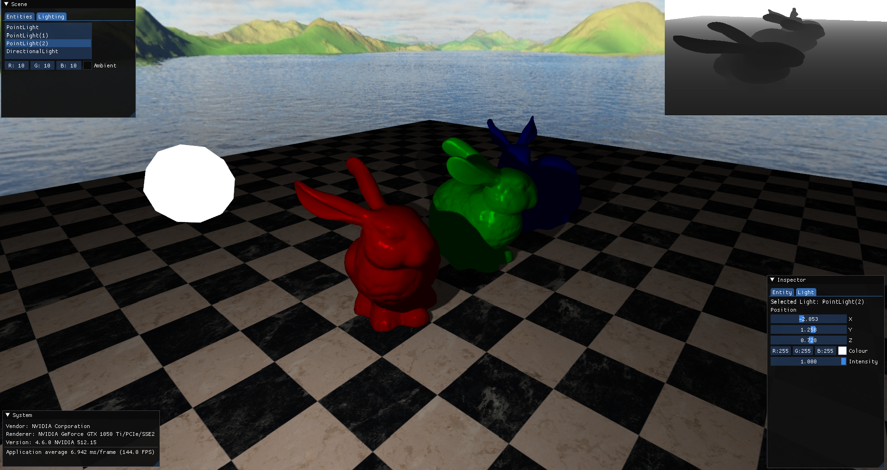
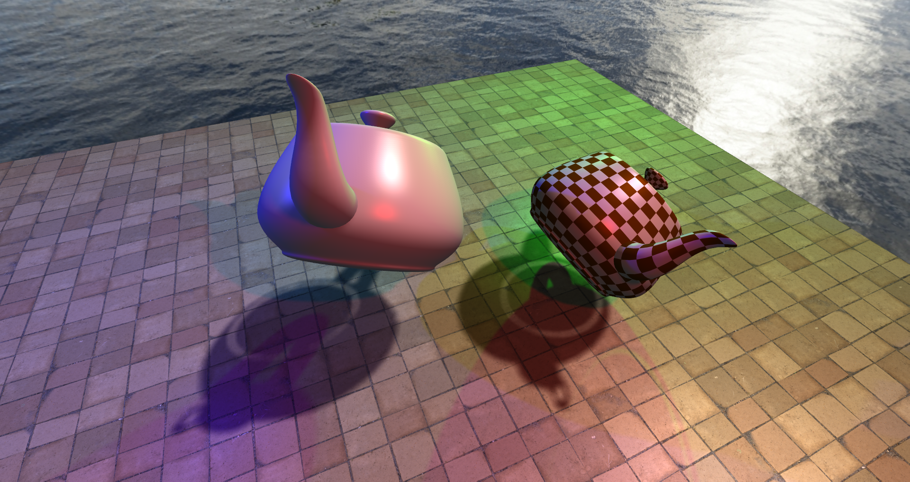
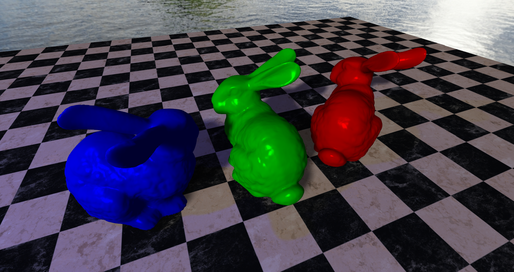
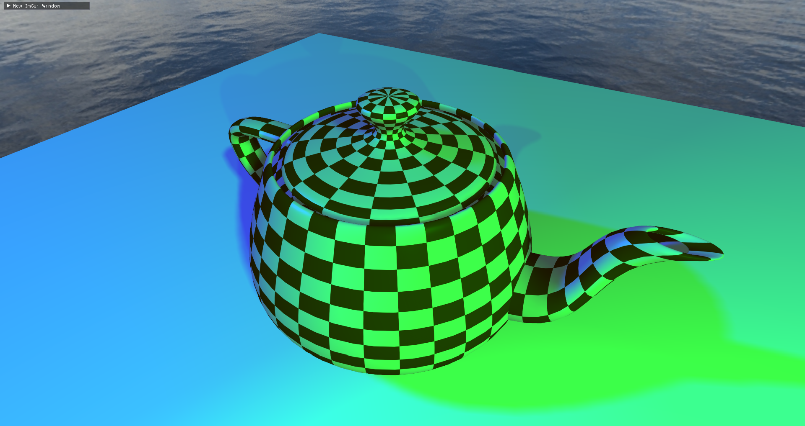
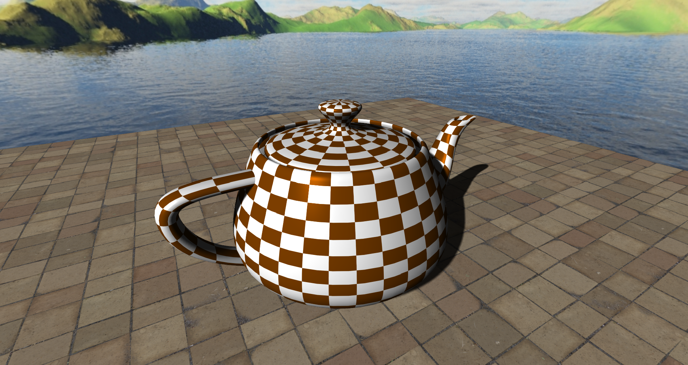
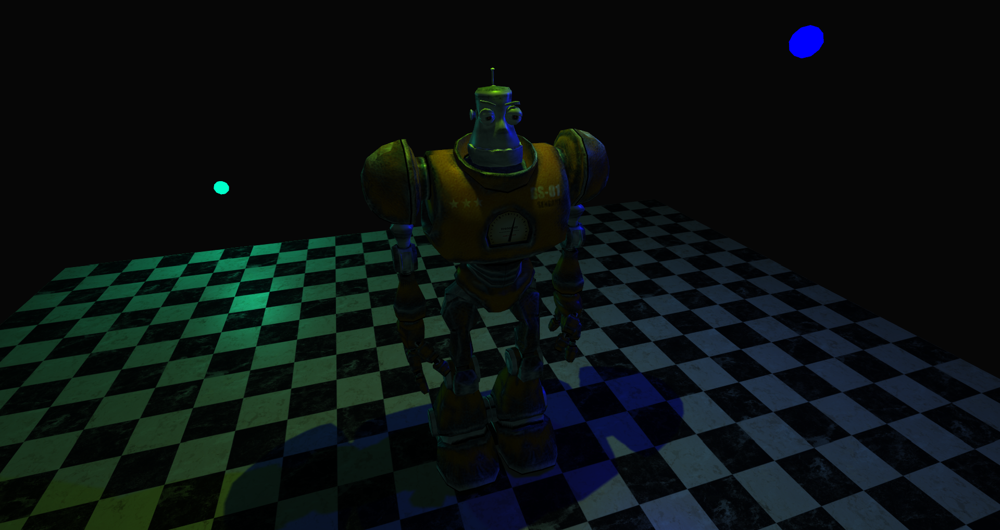
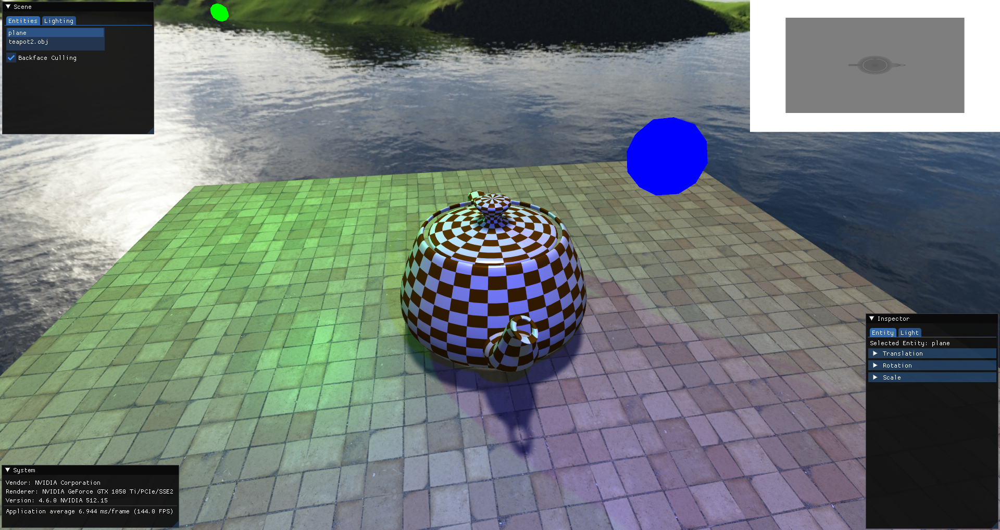
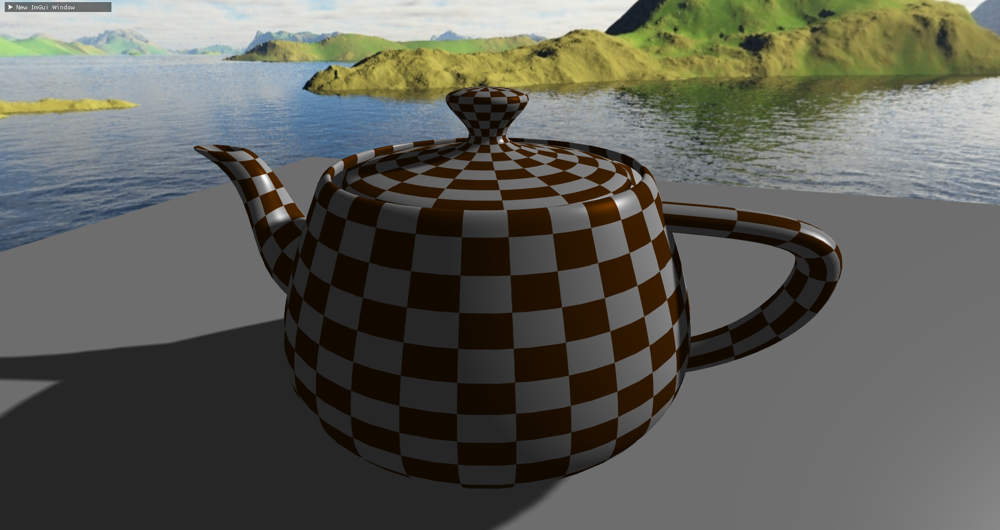

# 3D Graphics Engine (3DGE)
A 3D graphics engine written in C++ using OpenGL 4.3

<p align="center">

</p>

## Features
- Light sources
     * Directional Light
     * Point Light
- Phong reflection model
- Directional and Point shadow mapping with percentage-closer filtering (PCF)
- Skybox
- Polygon and texture anti-aliasing
- OBJ Loader
- Fly camera
- GUI using Dear ImGui

## Screenshots
<p align="center">







</p>

## Requirements
- Windows 10
- Microsoft Visual Studio 2019 Community Edition
- A graphics adapter that supports at least OpenGL 4.3

## How to run the engine
1. Download the repository
2. Launch the `3d-graphics-engine.sln` file
3. Within Visual Studio 2019, verify that the "Solution Configuration" is set to `Release` and the "Solution Platform" is set to `x64` 
4. Run

## Interface

- The mouse can be used to both manipulate the camera's view to look around the world and to interact with the GUI.
- In order to use the GUI, the cursor must be visible, and in order to look around, the cursor must be hidden.
    * Pressing the `ESC` key on the keyboard will reveal the cursor. Alternatively, using the mouse and clicking with the left mouse button within the application window will hide the cursor.

### Controls
- The engine features numerous keyboard controls for both navigation and debugging. 
The camera can be moved horizontally using the `W`, `A`, `S`, `D` keys, and vertically using the `Q` and `E` keys. 
- Wireframe rendering mode can be toggled by pressing the `F` key. All rendering effects will be disabled and only the triangles of the geometry will be outlined.
- `TAB` will toggle the ability to see the shadow maps of the light sources in the scene. `C` will allow the ability to cycle through the individual shadow maps.

A concise list of all keyboard controls is featured below.

| Key      | Action                       |
| -------- | -----------------------------|
| W        | Move forwards                |
| A        | Move left                    |
| S        | Move backwards               |
| D        | Move right                   |
| Q        | Move up                      |
| E        | Move down                    |
| ESC      | Reveal cursor                |
| F        | Toggle wireframe mode        |
| C        | Cycle debug shadow map       |
| TAB      | Toggle debug shadow map view |

### GUI Windows
To enhance the program's interactivity, the GUI contains several windows that either provide useful information or enable the ability to manipulate scene and object properties.
#### Scene Window
Includes general information and properties regarding the scene
- The `Entities` tab contains information regarding the entities in the scene.
    * A list box widget containing a list of all the entities in the scene.
    * Selecting an entity will mark it as the active entity, where its specific properties can then be modified in the `Inspector` window.
    - A checkbox to toggle backface culling.
- The `Lighting` tab contains properties related to the manipulation of light sources.
    * A list containing all of the light sources in the scene.
    * Selecting a light source will mark it as the "active light", whereupon its specific properties will be exposed in the `Inspector` window.
#### Inspector Window
Exposes the unique properties of the currently selected or "active" entity and light source. The name of the currently selected entity or light source is shown.
- For entities, it is possible to manipulate their transformation.
    * The `Translation` channels allow entities to moved across the world's X, Y and Z axes.
    * The `Rotation` channels allow entities to be rotated about the world's X, Y and Z axes. The range of rotation is between -180 to +180 degrees.
    * The `Scale` channel allows entities to be scaled uniformly, by a scale factor.
- For all light sources, it is possible to change the colour, using a colour picker and the light's intensity, by moving the slider.
- Point light sources can be translated by changing their `Position` channel values.
- The direction vector of directional light sources can be set by changing the `Direction` values. 
    * This vector will automatically be normalised upon being modified.

#### System Window
Displays graphics device and system information
- The `Vendor` field displays the vendor name of the graphics device, or the name of the company who has provided the running implementation of OpenGL.
- The `Renderer` field specifies the name of the graphics device.
- The `Version` field displays either the current version of OpenGL that is running, or the most up to date version of OpenGL on the system.
- The average application frame time and frame rate is also displayed here.

## Importing Assets
- When loading assets such as models and textures, the engine will look in predefined directories. 
- Consequently, the application may fail to proceed with execution if an asset is referenced that cannot be located during initialisation.
- All assets must be placed within a directory called `res`, that must lie in the directory one level above the current working directory.
### Models
- Models must be placed in a directory called `models`, within the `res` directory.
- The engine supports the Wavefront OBJ (`.obj`) file format, however there are some constraints:
    * The geometry contained must be triangulated.
    * The file must contain vertex positions, texture coordinates, vertex normals and faces only.
    * The file must only contain a single mesh, multiple meshes are not supported.
### Textures
- To use textures within the engine, they must be placed in a directory within `res` called `textures`. 
#### Cube maps
- If the texture is part of a cube map, it must be placed within a separately name directory within the `textures` directory.
- Additionally, each texture that represents a unique face for the cube map must be named appropriately, e.g. `left`, `top`, `right`, etc.

## Basic API Usage
This section aims to provide a basic overview of the API, and how it can be used to create scenes that contain many entities with unique materials, and that contain multiple light sources, with relative ease.

### Importing Assets
- The engine allows the easy importing of textures and models through its simple interface.
- Once a texture or model has been added, they will be stored and managed by the `GraphicsEngine` instance, until it is destroyed. 
- A reference to a `Texture` or `Mesh` can be retrieved through the relevant accessor methods.

Code example:
```c++
engine.AddTexture("tiled_floor.png");
engine.AddMesh("teapot.obj");

Texture* floorTexture = engine.GetTexture("tiled_floor.png");
```
### Entity Creation
- An `Entity` represents an object in the scene and all of its associated data. For example, its transformation, mesh, material and shader.
- To create an `Entity` instance, call `GraphicsEngine::CreateEntity()`. The function returns a pointer to the entity, allowing for the modification of its properties via accessor methods.
    * The method requires a parameter, the name of the mesh that the entity will use. This mesh must have been already added to the `GraphicsEngine` instance beforehand, before using the `GraphicsEngine::AddMesh()` method.

Code example:
```c++
// Assumes the existence of a GraphicsEngine instance "engine" and a
// valid model file located in the "models" directory called "teapot.obj".
engine.AddMesh("teapot.obj");

Entity* teapot = engine.CreateEntity("teapot.obj");
teapot->SetScale(1.2f);
...
```
### Adding a Skybox
- The engine allows the user to create a skybox for their scene if they wish to.
- Assuming the textures for the cube map have been set up properly, the user can tell the engine they want to use a particular skybox through `GraphicsEngine::SetSkybox()`.
   * The parameter is the directory name where all the correctly named cube map textures lie.

Code example:
```c++
// All cube map textures are located within the "cubemap" directory
engine.SetSkybox("cubemap");
```
